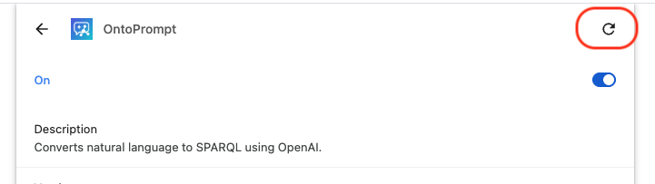

# OntoPrompt - A Chrome Extension to assist with writing SPARQL queries

## Description
OntoPrompt is a Chrome Extension designed for use with the site https://yasgui.triply.cc/# and to generate queries for the Ubergraph endpoint https://ubergraph.apps.renci.org/sparql. OntoPrompt allows the user to ask a question about an ontology in natural language and the Extension converts into a SPARQL query. OntoPrompt uses OpenAI to convert the natural language question into SPARQL, therefore an OpenAI API key is needed to use the Extension.

## Installation
- Clone or download the code. For stable versions, use the [latest release](https://github.com/twhetzel/sparql-chrome-extension/releases.)
- Open your Chrome browser and go to Settings --> Extensions
- Click on "Load unpacked". This will open a file browser. Select the entire folder that contains the Chrome Extension. A new card will be added to your Extensions for the OntoPrompt.
- In the upper-right hand side of the browser, click on the Extensions icon and pin the OntoPrompt Extension so the icon remains visible in your Chrome browser.
- Click on the OntoPrompt icon, which will launch a pop-up window where you can enter your OpenAI API key.
- Navigate to https://yasgui.triply.cc/#. The OntoPrompt window will be visible in the bottom right-hand side of the browser.

## Updating to the Latest Version
1. In your local repository, pull the latest code:
   ```
   git checkout main
   git pull
   ```
2. Open Chrome and navigate to `chrome://extensions/`.
3. Ensure **Developer mode** is enabled (toggle in the upper-right).
4. Locate the OntoPrompt card and click the **Reload** button (circular arrow) in the card’s upper-right corner (see the screenshot below).
5. If the OntoPrompt window is already open in a YASGUI tab, refresh the page to update the OntoPrompt extension.



**Note:** This Extension is under development and is not yet available in the Chrome Web Store.

## Prompting Guidelines
When writing the details of a SPARQL query in plain English be sure to include a mention of these important parts of a SPARQL query:
- what fields should be selected
- what ontology should be queried
- mention whether obsolete terms should be excluded
- mention other conditions that should be matched

To build up complex queries, start with a basic query and add more conditions as needed for the complexity of the query/information to extract from the ontology.

For detailed information on best practices for prompting to generate SPARQL queries, see the OBO Academy tutorial [Generating SPARQL queries using Large Language Models LLMs](https://oboacademy.github.io/obook/tutorial/sparql-llm/#generating-sparql-queries-using-large-language-models-llms)


## Additional Features
Request new features or post bug reports using the [issue tracker](https://github.com/twhetzel/sparql-chrome-extension/issues).
